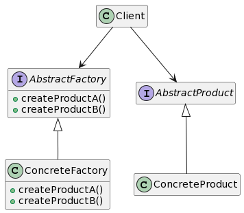

# Абстракнтная фабрика




```
// <<interface>> ProductA, ProductB, ...
class IProcessor
{
public:
	virtual void PerformOperation() = 0;
};
class IHardDisk
{
public:
	virtual void StoreData() = 0;
};
class IMonitor
{
public:
	virtual void DisplayPicture() = 0;
}; 

//ProductAX,ProductAY...
class ExpensiveProcessor : public IProcessor
{
public:
	void PerformOperation(){
		cout << "Operation will perform quickly" << endl;
	}
};
class CheapProcessor : public IProcessor
{
public:
	void PerformOperation() {
		cout << "Operation will perform Slowly" << endl;
	}
};
class HighResolutionMonitor : public IMonitor
{
public:
	void DisplayPicture() {
		cout<<"Picture quality is Best"<<endl;
	}
};
class LowResolutionMonitor : public IMonitor
{
public:
	void DisplayPicture() {
		cout<< "Picture quality is Average"<< endl;
	}
};

// <<interface>> AbstractFactory
class IMachineFactory
{
public:
	virtual IProcessor* GetRam() = 0;
	virtual IHardDisk * GetHardDisk() = 0;
	virtual IMonitor * GetMonitor() = 0;
};

// ConcreteFactoryX ConcreteFactoryY ...
class HighBudgetMachine :public IMachineFactory
{
public:
	IProcessor* GetRam() { return new ExpensiveProcessor();}
	IHardDisk* GetHardDisk() { return new ExpensiveHDD(); }
	IMonitor*
	GetMonitor() { return new HighResolutionMonitor(); } 
};
class LowBudgetMachine : public IMachineFactory
{
public:
	IProcessor* GetRam() { return new CheapProcessor(); }
	IHardDisk* GetHardDisk() { return new CheapHDD(); }
	IMonitor*
	GetMonitor() { return new LowResolutionMonitor();}
};

class ComputerShop
{
	IMachineFactory *category;
public:
	ComputerShop(IMachineFactory *_category) { category = _category; }
	void AssembleMachine() {
		IProcessor* processor = category->GetRam();
		IHardDisk* hdd = category->GetHardDisk();
		IMonitor* monitor = category->GetMonitor();
		//используем все три категории для создании машины
		processor->PerformOperation();
		hdd->StoreData();
		monitor->DisplayPicture();
	}
};


int main(){
	MachineFactory *factory = new HighBudgetMachine();// или new
	LowBudgetMachine();
	ComputerShop *shop = new ComputerShop(factory);
	shop->AssembleMachine();
}
```


