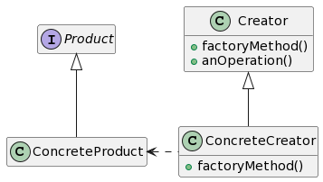

# Фабричный метод 



```c++
class Product{
  virtual string getName() = 0;
  virtual ~Product(){}
};

class ConcreteProductA: Product{
  string getName(){return "ConcreteProductA";}
};

class ConcreteProductB: Product{
  string getName(){return "ConcreteProductB";}
};

class Creator{
  virtual Product* factoryMethod() = 0;
};

class ConcreteCreatorA: Creator{
  Product* factoryMethod(){return new ConcreteProductA();}
};

class ConcreteCreatorB: Creator{
  Product* factoryMethod(){return new ConcreteProductB();}
};

int main()
{
  ConcreteCreatorA CreatorA;
  ConcreteCreatorB CreatorB;
  // Массив создателей
  Creator*creators[] = {&CreatorA, &CreatorB};
  //Перебирайте создателей и создавайте продукты
  for(auto&& creator: creators){
    Product* product=creator->factoryMethod();
    cout << product->getName() << endl;
    delete product;
  }
  return 0;
}
```
