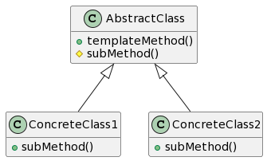

# Шаблонный метод



```c++
class AbstractAlgorithm
{
public:
	void makeAllAlgorithmSteps(){
		step1();
		step2();
		step3();
	}
protected:
	virtual void step1() = 0;
	virtual void step2() = 0;
	void step3() {/* Реализация */}
};

class ConcreteAlgorithm_1
{
protected:
	void step1(){/* Реализация для ConcreteAlgorithm_1 */}
	void step2(){/* Реализация для ConcreteAlgorithm_1 */}
};
class ConcreteAlgorithm_2
{
protected:
	void step1(){/* Реализация для ConcreteAlgorithm_2 */}
	void step2(){/* Реализация для ConcreteAlgorithm_2 */}
};

int main(){
	AbstractAlgorithm *algorithm1 = new ConcreteAlgorithm_1();
	algorithm1->makeAllAlgorithmSteps();
	delete algorithm1;
}

___
// Hooks
class AbstractAlgorithm
{
public:
	void makeAllAlgorithmSteps(){
		step1();
		step2();
		if(need_step_3()){
			step3();
		}
	}
protected:
	virtual void step1() = 0;
	virtual void step2() = 0;
	void step3() {/* Реализация */}
	// Hook
	virtual bool need_step_3(){ return true; }
};

class ConcreteAlgorithm_1
{
protected:
	void step1(){/* Реализация для ConcreteAlgorithm_1 */}
	void step2(){/* Реализация для ConcreteAlgorithm_1 */}
};
class ConcreteAlgorithm_2
{
protected:
	void step1(){/* Реализация для ConcreteAlgorithm_2 */}
	void step2(){/* Реализация для ConcreteAlgorithm_2 */}
	bool need_step_3(){return false;}
};

int main(){
	AbstractAlgorithm *algorithm2 = new ConcreteAlgorithm_2();
	algorithm2->makeAllAlgorithmSteps();
	delete algorithm2;
}
```

